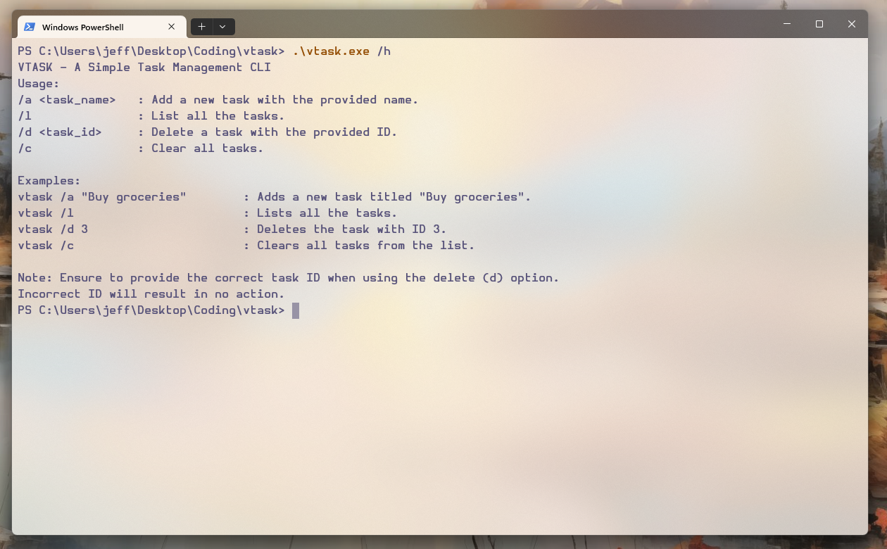
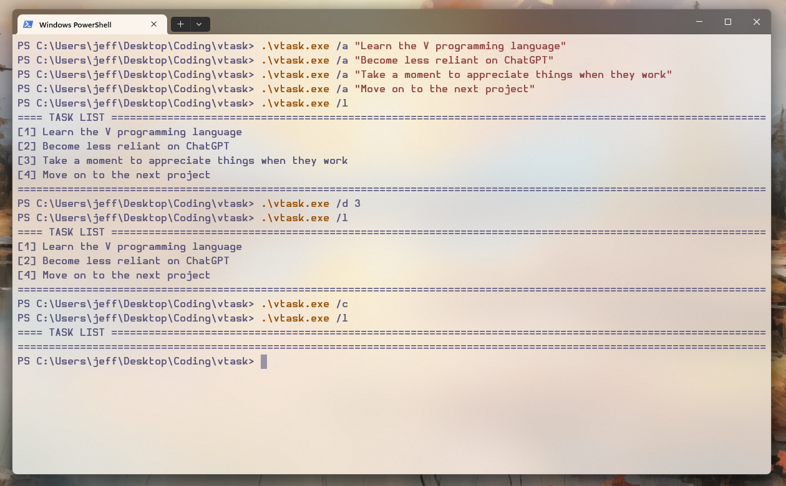

# VTASK - A Simple Task Management CLI
---

VTASK is a command-line interface application designed for simple task management.

With VTASK, you can quickly add, list, delete, and clear tasks.

## Prerequisites
---

- [V Compiler](https://vlang.io/)

## Installation
---

1. Clone this repository: `git clone https://github.com/etsea/vtask.git`
2. Navigate to the cloned directory: `cd vtask`
3. Compile the source code: `v -prod .`

## Usage
---

`vtask [option] [arguments]`

## Options
---

```sh
- /a (or -a on non-Windows systems) <task_name>: Add a new task with the provided name.
- /l (or -l): List all the tasks.
- /d (or -d) `<task_id>`: Delete a task with the provided ID.
- /c (or -c): Clear all tasks.
```

## Examples
---

- `vtask -a "Buy groceries"`: Adds a new task titled "Buy groceries".
- `vtask -l`: Lists all the tasks.
- `vtask -d 3`: Deletes the task with ID 3.
- `vtask -c`: Clears all tasks from the list.

## Screenshots
---




## Contributing
---

This project is primarily a proof-of-concept created as part of my learning journey with Vlang. While it's not actively seeking contributions, feedback or suggestions on improving the code or adopting best practices in Vlang are always appreciated.

## License
---

[MIT](https://github.com/etsea/vtask/blob/main/LICENSE)
