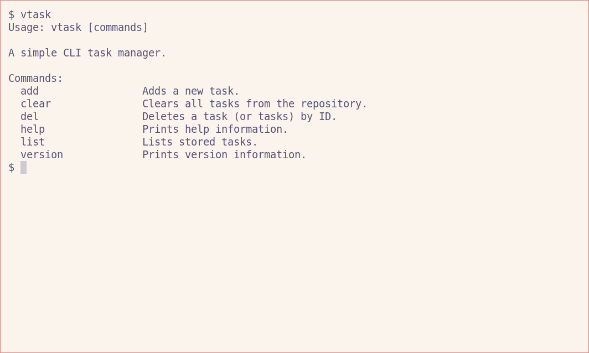
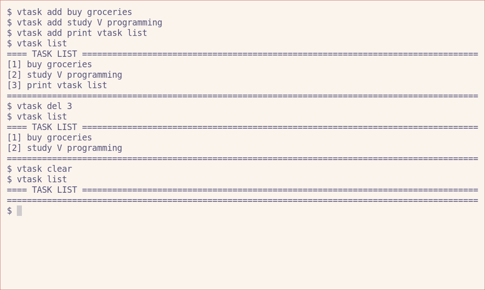

# VTASK - A Simple Task Management CLI

VTASK is a command-line interface application designed for simple task management.

With VTASK, you can quickly add, list, delete, and clear tasks.

## Prerequisites

- [V Compiler](https://vlang.io/)

## Installation

1. Clone this repository: `git clone https://github.com/etsea/vtask.git`
2. Navigate to the cloned directory: `cd vtask`
3. Compile the source code: `v -prod .`

## Usage

`vtask [command] (args)`

## Commands

```
- add: Adds a new task.
- list: Lists stored tasks.
- del: Deletes a task (or tasks) by ID.
- clear: Clears all tasks from the repository.
- help: Prints help information.
- version: Prints version information.
```

## Usage Example

```
$ vtask add buy groceries
$ vtask add study V programming
$ vtask add print vtask list
$ vtask list
==== TASK LIST ============================
[1] buy groceries
[2] study V programming
[3] print vtask list
===========================================
$ vtask del 3
$ vtask list
==== TASK LIST ============================
[1] buy groceries
[2] study V programming
===========================================
$ vtask clear
$ vtask list
==== TASK LIST ============================
===========================================
```

## Screenshots




## Contributing

This project is primarily a proof-of-concept created as part of my learning journey with Vlang. While it's not actively seeking contributions, feedback or suggestions on improving the code or adopting best practices in Vlang are always appreciated.

## License

[MIT](https://github.com/etsea/vtask/blob/main/LICENSE)
